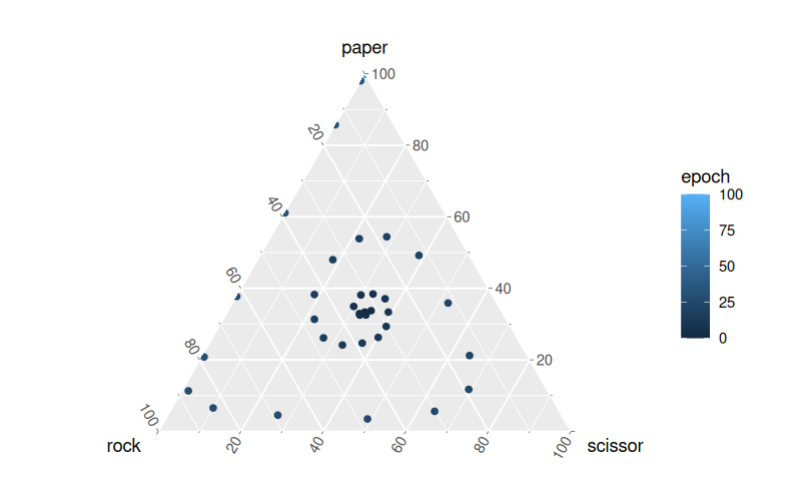

# Simple simulator for rock-scissor-paper evolutions

[Online version](https://tinytinni.github.io/primer-rock-scissor-paper-sim/)

While watching the video by Primer [link](https://www.youtube.com/watch?v=tCoEYFbDVoI), I wanted to test the simulation with different values.

Therefore, a simple R script which let's you do this.

